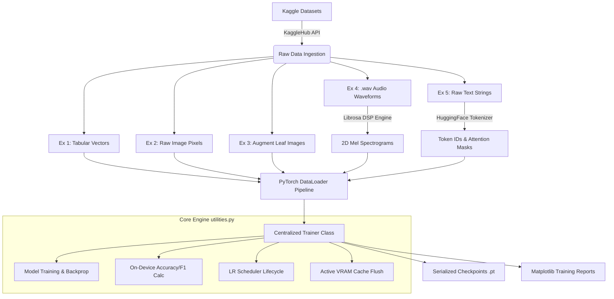

# 🏗️ Classification Hub — Production-Grade PyTorch Mastery

A comprehensive deep learning suite tackling five classification challenges using a unified, high-performance training framework built in PyTorch.

---

<div align="center">
    
</div>

---

## 📋 Project Overview

The **Classification Hub** is an end-to-end machine learning engineering repository demonstrating state-of-the-art model architectures across five core data modalities: **Tabular, Computer Vision (Scratch), Computer Vision (Transfer Learning), Audio Digital Signal Processing (DSP), and Natural Language Processing (NLP)**.

Rather than deploying disparate scripts for each task, this repository leverages a centralized, production-ready execution engine (`utilities.py`). This engine encapsulates optimization, hardware-accelerated metric evaluation, advanced learning rate scheduling, automated checkpointing, and aggressive VRAM lifecycle management following the DRY (Don't Repeat Yourself) principle.

---

## 🚀 Key Features

* **Unified Core Training Framework:** Automated multi-class and binary pipelines handling model training, evaluation, and inference seamlessly.
* **On-Device Metric Processing:** Native, GPU-accelerated implementation of accuracy and macro F1-score tracking without CPU bottlenecks.
* **Multi-Modal Mastery:** End-to-end pipelines addressing tabular data, custom 2D Convolutional Neural Networks (CNNs), deep transfer learning backbones, time-frequency audio DSP conversions, and transformer fine-tuning.
* **Robust Memory Optimization:** Embedded deterministic garbage collection and accelerator cache-flushing layers to actively mitigate Out-Of-Memory (OOM) exceptions on resource-constrained environments like Google Colab T4 GPUs.
* **Production Tooling:** Automated checkpointing of the best and latest state-dicts, metadata tracking, and automatic dataset streaming through the `kagglehub` API.

---

## 📐 Architecture Overview

The system isolates task-specific preprocessing and model definitions from the structural training logic. Each project prepares its independent dataset into PyTorch `DataLoaders`, which are then ingested by the shared execution matrix:



---

## 📂 Project Structure

```text
classification_hub/
├── Ex_1_Tabular_Classification.ipynb         # Tabular pipeline for Rice Type Classification
├── Ex_2_Image_Classification.ipynb           # Custom CNN built from scratch for Animal Faces
├── Ex_3_Image_Classification_Pretrained.ipynb# Transfer learning for Bean Leaf Disease Detection
├── Ex_4_Audio_Classification.ipynb           # Audio Mel-Spectrogram pipeline for Reciter ID
├── Ex_5_Text_Classification_Transformers.ipynb# Transformer fine-tuning for Sarcasm Detection
├── utilities.py                              # Centralized core training & evaluation framework
└── README.md                                 # Project documentation

```

### Key Components Description

* **`utilities.py`**: The backbone of the repository. Contains `TrainerConfig` (hyperparameter routing), `Trainer` (state management, loop tracking, visualization), and operational helpers (`predict`, `save_model_weights`, `download_kaggle_dataset`).
* **`Ex_1` to `Ex_5` Notebooks**: Individual workflow configurations containing task analysis, feature preprocessing implementations, model declarations, and inference demos.

---

## 🛠️ Technology Stack

| Category | Technologies |
| --- | --- |
| **Core Language** | Python 3.10+ |
| **Deep Learning Framework** | PyTorch (Core, Vision, Audio) |
| **NLP Ecosystem** | Hugging Face (Transformers, Tokenizers) |
| **Signal Processing** | torchaudio (Digital Signal Processing / Mel Spectrograms) |
| **Data Orchestration** | Pandas, NumPy, Scikit-Learn |
| **Visualization** | Matplotlib, Tqdm |
| **Compute Targets** | NVIDIA T4 GPU / CUDA Accelerated |

---

## 🔬 The Five Classification Challenges

Every pipeline is bound to strict performance criteria and requires a live inference demo executing validation on novel, raw test instances.

### 📊 Exercise 1: Tabular Classification (Rice Type Classifier)

* **Problem Statement:** Classify distinct rice types based on structural morphological features.
* **Data Characteristics:** High-density, clean numeric tabular vectors requiring low convergence time.
* **Solution Architecture:** Multi-Layer Perceptron (MLP) mapping dense vector topologies through fully connected layers interleaved with Batch Normalization and ReLU activations.
* **Target Metric:** $\ge 92\%$ Final Accuracy.

### 🖼️ Exercise 2: Image Classification From Scratch (Animal Face Classifier)

* **Problem Statement:** Multi-class classification of distinct animal profiles from raw pixel variations.
* **Data Characteristics:** Variable resolution, multi-channel structural images.
* **Solution Architecture:** A deep 2D Convolutional Neural Network (CNN) built entirely from scratch. Leverages progressive channel expansion ($3 \rightarrow 32 \rightarrow 64 \rightarrow 128$), pooling operations, and severe regularization (Dropout) to counter spatial overfitting.
* **Target Metric:** $\ge 75\%$ Final Accuracy.

### 🌿 Exercise 3: Image Classification via Transfer Learning (Bean Leaf Disease Detector)

* **Problem Statement:** Detect specific agricultural pathologies affecting plant leaves.
* **Data Characteristics:** Natural, variable-lighting biological textures with subtle fine-grained variance.
* **Solution Architecture:** Feature extraction and downstream fine-tuning using a premier deep backbone pretrained on ImageNet (e.g., ResNet-18). The feature representation layers are frozen, while custom linear layers map class probabilities. Detailed architectural justifications are documented in-notebook.
* **Target Metric:** $\ge 88\%$ Final Accuracy.

### 🎵 Exercise 4: Audio Classification (Quran Reciter Identifier)

* **Problem Statement:** Identify specific target speaker voices using raw acoustic recordings.
* **Data Characteristics:** Multi-second native `.wav` continuous audio waveform arrays.
* **Solution Architecture:** Implements an advanced intermediate processing pipeline utilizing `librosa.feature.melspectrogram`. Signals are downsampled and converted into 2D structural time-frequency representations (Mel Spectrograms), effectively mapping audio classification into a 2D CNN workspace.
* **Target Metric:** $\ge 70\%$ Final Accuracy.

### 📝 Exercise 5: Text Classification via Transformers (Sarcasm Detector)

* **Problem Statement:** Unveil abstract linguistic context to classify text fragments as sarcastic or literal.
* **Data Characteristics:** Short-form text utterances, headlines, and phrase sequences.
* **Solution Architecture:** Contextual sentence embeddings mapped using Hugging Face Transformer architectures. Tokenized sequences pass through attention masks feeding fine-tuned linear sequence heads.
* **Target Metric:** $\ge 82\%$ Final Accuracy.

---

## ⚙️ Core Engineering Engine: `utilities.py`

The core framework decouples operational infrastructure from network layouts.

### 1. `TrainerConfig`

A structured dataclass encapsulating execution configurations:

```python
@dataclass
class TrainerConfig:
    device: str = "cuda" if torch.cuda.is_available() else "cpu"
    epochs: int = 10
    batch_size: int = 32
    lr: float = 1e-3
    weight_decay: float = 1e-2
    scheduler_type: Optional[str] = "cosine"  # 'cosine', 'reduce_on_plateau', 'exponential', None
    scheduler_monitor_metric: str = "val_loss"
    task_type: str = "multiclass"              # 'binary' or 'multiclass'
    checkpoint_dir: str = "./checkpoints"
    best_model_filename: str = "best_model.pt"
    last_model_filename: str = "last_model.pt"

```

### 2. High-Performance Utilities

* **Memory Shielding:** Automated execution of `Trainer._clear_vram_cache()` isolates tensor operations, triggers Python garbage collection (`gc.collect()`), and clears active device memory buffers (`torch.cuda.empty_cache()`) immediately after evaluations.
* **Native Metrics Loop:** Evaluates macro F1-score and system wide accuracy directly on-device, bypassing frequent tensor cloning to host CPU memory.

---

## 💾 Installation & Setup

### Prerequisites

Execution is fully optimized for **Google Colab runtimes backed by a T4 GPU Instance**.

### Dependency Setup

To replicate the environment locally or within a notebook instance, install the required suite:

```bash
pip install torch torchvision torchaudio transformers librosa matplotlib tqdm kagglehub

```

### Kaggle API Configuration

To handle automated downloads for the 5 target datasets, configure the local environment with active Kaggle developer tokens:

```python
from google.colab import files
import os

# Prompt user for credentials download from Kaggle Account Settings
files.upload() 

# Direct token routing
os.system("mkdir -p ~/.kaggle && mv kaggle.json ~/.kaggle/ && chmod 600 ~/.kaggle/kaggle.json")

```

---

## 🚀 Usage Workflow

Running any modal pipeline follows a structured, consistent blueprint:

```python
import torch
import torch.nn as nn
from torch.utils.data import DataLoader
from utilities import Trainer, TrainerConfig, download_kaggle_dataset

# 1. Acquire Data Asset
dataset_path = download_kaggle_dataset("mssmartypants/rice-type-classification")

# 2. Instantiate Custom Pipeline Component DataLoaders
# train_loader = DataLoader(...)
# val_loader = DataLoader(...)

# 3. Define Model and Loss Objective
model = YourCustomModel()
criterion = nn.CrossEntropyLoss()

# 4. Construct Execution Metrics
config = TrainerConfig(
    epochs=12,
    lr=5e-4,
    scheduler_type="cosine",
    task_type="multiclass"
)

# 5. Execute Optimization Pipeline
trainer = Trainer(
    model=model,
    config=config,
    criterion=criterion,
    train_loader=train_loader,
    val_loader=val_loader
)

history = trainer.fit()

# 6. Generate Performance Deliverables
trainer.plot_metrics(save_path="training_metrics.png")

```

---

## 🛠️ Performance Tuning & Troubleshooting

If convergence delays or metrics stagnate during execution, utilize the following engineering checklist:

* **Initial Loss Sanity Check:** Verify your output layer activation. Ensure that initial epoch losses evaluate close to $- \log(1 / n_{\text{classes}})$. Divergence indicates improper output scaling or activation mapping.
* **Mitigating Severe Overfitting:** If training metrics outpace validation paths significantly, inject higher Dropout ratios inside your models or integrate data augmentation transforms (e.g., `torchvision.transforms.RandomHorizontalFlip`).
* **Managing Underfitting:** If accuracy trails target objectives uniformly across both splits, step up model capacity (increase layers/channels) or scale training timelines.
* **Learning Rate Optimization:** If loss graphs oscillate wildly across iterations, divide your base configuration learning rate by 10. If progress remains static, multiply it by 10.

---

## 📊 Evaluation Rubric Metrics

All implementations are benchmarked against four distinct metrics for grading:

1. **Model Quality:** Meets or exceeds the specific baseline accuracy targets.
2. **Training Report:** Comprehensive validation logging with complete loss and accuracy curve tracking.
3. **Code Quality:** Adherence to standard conventions, functional encapsulation, and zero pipeline duplication.
4. **Inference Demo:** A live, non-hardcoded evaluation pipeline computing raw unseen validation files.

---

## 📄 License

This repository is distributed for educational and development purposes under a standard private portfolio structure. Please consult specific Kaggle hosts regarding underlying source dataset licenses.

---

## 👥 Contact & Community

For community debugging and collaborative optimization sharing, connect through the [SAIR Repository Hub](https://github.com/SAIR-Org). Provide detailed loss curves and complete `utilities.py` parameter blocks when troubleshooting pipeline behaviors.
